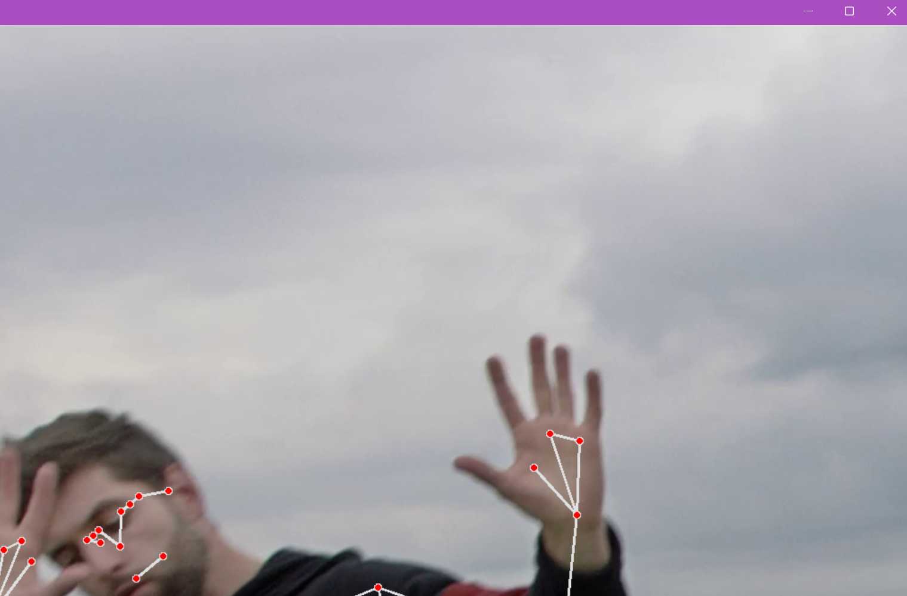

# Pose Estimation

This project utilizes MediaPipe and OpenCV for real-time pose detection. By processing webcam input, it accurately identifies and annotates key points on the human body. With MediaPipe's Pose module, it visualizes these points and their connections, offering insights into detected poses. Additionally, the system calculates and displays the frame rate, ensuring smooth performance. 

